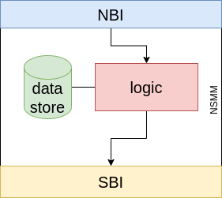

# network-service-mesh-manager (NSMM)
First version of Network Service Mesh Manager implemented using Go and github.com/gophercloud/gophercloud v0.23.

## Architecture



## Project Structure
Following the basic layout for Go application projects (https://github.com/golang-standards/project-layout), the project structure is described below:
```
.
├── api/                # Postman collection and tests with OpenApi code generators
├── cmd/                # Main applications
    └── nsmm
        └── main.go
    └── openapi         # Test with OpenAPI code gen
        └── main.go
├── docs/               # Docs/images
├── internal/           # Internal packages
    ├── config
    ├── nbi
    └── openstackclient
├── sbi/                # SBI realized as a Postman Collection (test)
├── config.yaml         # Config file
├── go.mod
├── go.sum
└── README.md

```
## NBI API
It exposes 3 API to interact with OpenStack and create/retrieve/delete networks and subnets, which are part of the __Network pre-provisioning__:
```
GET network?name={name}
POST network?name={name} + body
DELETE network?name={name}
```
then there are API for the __Network provisioning__, they implement the basic workflow to prepare network connection to assign a floating IP to a VM on OpenStack:
```
POST /gateway/connectivity?sliceId={} + body with cidr
GET /gateway/connectivity?sliceId={}
DELETE /gateway/connectivity?sliceId={}
```
- the _POST_ creates a private network with a subnet on the specified cidr, then it creates a router connected with the floating network and the private network.
- _GET_ retrieves all the associated resources to that slice (network, subnet and router)
- _DELETE deletes all the associated resources to that slice (network, subnet, and router)

Then, some utils API
```
GET /clean
POST /clean
GET /management/db
POST /management/db?sliceId={} + body con gateway infos
DELETE /management/db?sliceId={}
```

These API are described in the Postman collection `NSMM.postman_collection.json`

## Run
Install Go: https://golang.org/doc/install

All the dependencies are listed in the `go.mod`

Run the code:
```
go run cmd/nsmm/main.go
```
or
```
cd /cmd/nsmm
go run .
```
or creating an executable file:
```
cd /cmd/nsmm
go build
./nsmm
```

## Terminate
Terminate the program with <CTRL+C> to revoke the token


# SBI
First design of SBI is a Postman Collection:
[Readme](sbi/README.md)