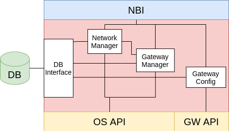

# network-service-mesh-manager (NSMM)
First version of Network Service Mesh Manager implemented using Go and github.com/gophercloud/gophercloud v0.22.

## Architecture



## Project Structure
Following the basic layout for Go application projects (https://github.com/golang-standards/project-layout), the project structure is described below:
```
.
├── api/                # Postman collection to use the NSMM NBI
├── cmd/                # Main applications
    └── nsmm
        └── main.go
├── docs/               # Docs/images
├── internal/           # Internal packages
    ├── nbi
    └── openstackclient
├── sbi/                # SBI realized as a Postman Collection (test)
├── go.mod
├── go.sum
└── README.md

```
## NBI API
It exposes 3 API to interact with OpenStack and create/retrieve/delete networks and subnets:
```
GET network?name={name}
POST network?name={name} + body
DELETE network?name={name}
```

These API are described in the Postman collection `api/NSMM - NetworkManager`

## Run
Install Go: https://golang.org/doc/install

All the dependencies are listed in the `go.mod`

Run the code:
```
cd /cmd/nsmm
go run .
```
or creating an executable file:
```
cd /cmd/nsmm
go build
./nsmm
```

## Terminate
Terminate the program with <CTRL+C> to revoke the token

## Test
Execute all the tests files
```
go test ./...
```

Execute only one test file
```
go test test/provisioning_test.go
```

Execute a function
```
go test packageName -run NameOfTest
go test ./... -run "GatewayConnectivityRetrieve" -v
```


# SBI
First design of SBI is a Postman Collection:
[Readme](sbi/README.md)