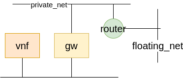

# SBI network-service-mesh-manager

## Structure
- __NSMM Postman environment__ file containing the environment variables to interact with the VIM, such as: OpenStack IP, Keystone port, Neutron port, Username and password of a user.
- __NetworkServiceMeshManager__ Postman collection which contains:
    - Variables (scope collection) defining parameters used in the API calls
    - REST calls which implement:
        - __Authentication__
        - Pre-provisioning of networks for NS deployment (called __Network pre-provisioning__)
        - Basic workflow for the creation of necessary elements to associate a floating IP to an instance (__Network provisioning__)

According to that, Postman Collection is organized into 3 folders:
- Authentication
- Network pre-provisioning
- Network provisioning
- Utils, containing GET calls to retrieve the state

## Authentication
In order to execute REST calls, a token should be provided in each request using the `X-Auth-Token` header. A token can be:
- Unscopen Token
- Scoped Token

The token is generated authenticating with one of the two POST calls in the `Authentication` folder of the Postman Collection. The test script saves the token in the `TOKEN` environment variable.

The token can be revoked with the `Revoke Token` REST call.

## Pre-provisioning of networks
Since OSM requires all networks to be in place during the instatiation of Network Sevices, NSMM must create them before the instantiation process.
The API calls are defined in the folder `Network pre-provisioning` of the Postman Collection.

In order to create a network:
1. Create Network
2. Create Subnet

## Network Provisioning (Basic workflow)
In order to use the gatewayVNF as a router/gateway toward the outside world and assign a floating IP to it, the following env should be set:

1. A private_net should be created
2. A router with floating_net as external network should be created
3. Add interface to the router on the private_net
4. Create the gateway instance with 2 interfaces: one on the private_net, the other on the network which should be passed as parameter. __TODO__

### The REST calls to do that:
1. Create private_net
2. Create private_subnet
3. Create Router with external gateway to the floating_net
4. Add interface to router to private_net

### To remove all 
1. Remove interface from router. 
2. Delete router
3. Delete private_subnet 
4. Delete private_network
